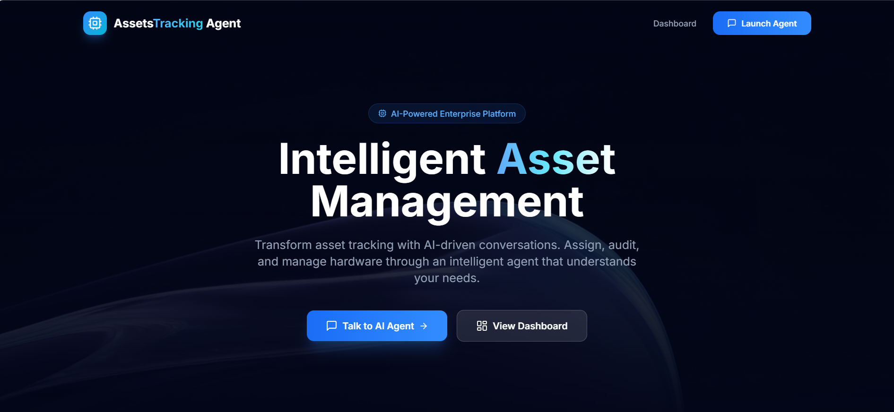
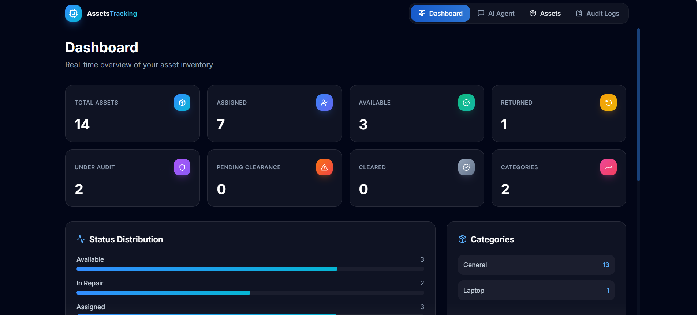

# 🧠 AssetsTracking Agent

### AI-Powered Conversational Corporate Asset Management System


---

## 📘 Overview

**AssetsTracking Agent** is a modern **Agentic AI platform** for corporate asset management. It combines an intelligent conversational AI agent powered by Groq (`llama-3.3-70b-versatile`) with a comprehensive enterprise dashboard for tracking, auditing, and managing corporate hardware assets.

### Key Features

- 🤖 **AI-Powered Chat Agent** — Natural language asset management with tool-calling capabilities using Groq
- 📊 **Enterprise Dashboard** — Real-time analytics with animated statistics and status tracking
- 📦 **Full Asset Lifecycle** — CRUD operations + Assign → Return → Audit → Clear workflow
- 🔍 **Smart Search & Filter** — Search by name, type, brand, employee, category, or status
- 📋 **Audit Trail** — Complete logging of every action for compliance
- 🎨 **Premium UI** — Glassmorphism, Framer Motion animations, dark mode
- 📱 **Responsive Design** — Works on desktop, tablet, and mobile

---

## 🚀 Quick Start

### Prerequisites

- **Python 3.10+** with pip
- **Node.js 18+** with npm
- **Groq API Key** — Get one at [console.groq.com](https://console.groq.com/)

### 1. Clone & Setup Backend

```bash
cd backend
pip install -r requirements.txt
```

### 2. Configure API Key

```bash
# Copy the example env file
cp .env.example .env

# Edit .env and add your Groq API key
# GROQ_API_KEY=your_actual_key_here
```

### 3. Start Backend Server

```bash
cd backend
python main.py
```

Backend runs at: `http://localhost:8080`

### 4. Setup Frontend

```bash
cd frontend
npm install
```

### 5. Start Frontend Dev Server

```bash
cd frontend
npm run dev
```

Frontend runs at: `http://localhost:5173`

---

## 🏗️ Project Structure

```
Asset-Tracking-Agent/
├── backend/
│   ├── agent/
│   │   ├── agent.py          # AI agent configuration with tools
│   │   ├── prompt.py         # Agent system prompt
│   │   └── tools.py          # Agent tool functions
│   ├── core/
│   │   ├── db.py             # Database instance
│   │   └── sqlite_db.py      # SQLite database with migration
│   ├── models/
│   │   └── data_model.py     # Pydantic models
│   ├── repos/
│   │   └── assets_repo.py    # Data access layer
│   ├── routers/
│   │   └── assets.py         # REST API endpoints
│   ├── services/
│   │   └── assets_service.py # Business logic layer
│   ├── .env                  # API key configuration
│   ├── .env.example          # Template for env file
│   ├── main.py               # FastAPI application entry
│   └── requirements.txt      # Python dependencies
│
├── frontend/
│   ├── src/
│   │   ├── components/
│   │   │   ├── assets/       # Asset management views
│   │   │   ├── audit/        # Audit log viewer
│   │   │   ├── chat/         # AI chat interface
│   │   │   ├── dashboard/    # Analytics dashboard
│   │   │   ├── layout/       # Navbar, layout
│   │   │   └── ui/           # Reusable UI components
│   │   ├── pages/
│   │   │   └── LandingPage.tsx
│   │   ├── services/
│   │   │   └── apiService.ts # API client
│   │   ├── types/
│   │   │   └── index.ts      # TypeScript types
│   │   ├── App.tsx           # Root component
│   │   ├── index.css         # Global styles
│   │   └── main.tsx          # Entry point
│   ├── legacy/               # Original HTML/JS frontend
│   ├── package.json
│   ├── tailwind.config.js
│   └── vite.config.ts
│
└── README.md
```

---

## 🔧 Tech Stack

| Layer    | Technology                                          |
|----------|-----------------------------------------------------|
| Frontend | React 19, TypeScript, Vite, Tailwind CSS, Framer Motion |
| Backend  | Python, FastAPI, Groq SDK, SQLite                   |
| AI       | Groq (llama-3.3-70b-versatile)                      |
| Icons    | Lucide React                                        |

---

## 📡 API Endpoints

| Method | Endpoint                    | Description              |
|--------|-----------------------------|--------------------------|
| GET    | `/assets/`                  | List all assets          |
| GET    | `/assets/stats`             | Dashboard statistics     |
| GET    | `/assets/search?q=`         | Search assets            |
| GET    | `/assets/status/{status}`   | Filter by status         |
| GET    | `/assets/employee/{name}`   | Filter by employee       |
| GET    | `/assets/category/{cat}`    | Filter by category       |
| GET    | `/assets/audit-logs`        | Get audit logs           |
| GET    | `/assets/{id}`              | Get asset by ID          |
| POST   | `/assets/`                  | Create asset             |
| PUT    | `/assets/{id}`              | Update asset             |
| PUT    | `/assets/{id}/assign`       | Assign to employee       |
| PUT    | `/assets/{id}/return`       | Mark as returned         |
| PUT    | `/assets/{id}/clearance`    | Mark as cleared          |
| DELETE | `/assets/{id}`              | Delete asset             |

---

## 🤖 AI Agent Commands

The AI agent understands natural language. Example commands:

- `"Show all assets"` — Lists entire inventory
- `"Assign laptop to Ravi"` — Assigns an asset to an employee
- `"How many assets are assigned?"` — Returns count
- `"Show pending returned assets"` — Filters by status
- `"Generate audit summary"` — Provides dashboard insights
- `"Search for Dell laptops"` — Smart search
- `"Clear employee assets"` — Processes clearance workflow





---

## 🌐 Deployment Instructions

### Backend (Render + Docker)

1. **Create a New Web Service** on [Render](https://render.com) and connect your GitHub repository.
2. **Environment Variables**:
   - `GROQ_API_KEY`: Your Groq API Key (e.g., `gsk_...`)
   - `PORT`: Automatically managed by Render (defaults to `10000`).
3. **Build & Deploy Configuration**:
   - **Runtime**: Docker
   - **Dockerfile Path**: `backend/Dockerfile`
   - **Docker Context**: `backend`
4. The service will automatically build and launch FastAPI using Uvicorn on the dynamically assigned port.

### Frontend (Vercel)

1. **Create a New Project** on [Vercel](https://vercel.com) and import the repository.
2. **Framework Preset**: Vite
3. **Root Directory**: Select `frontend`
4. **Environment Variables**:
   - `VITE_API_URL`: Set to your deployed Render backend URL (e.g., `https://your-render-service.onrender.com`). Do NOT include a trailing slash.
5. **SPA Routing**: Client-side navigation is automatically handled by the included `vercel.json` rewrite rules (`/(.*)` -> `/index.html`).

---

## 📄 License

© 2025 AssetsTracking Agent. All rights reserved.
